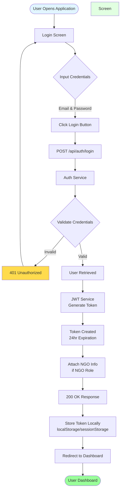
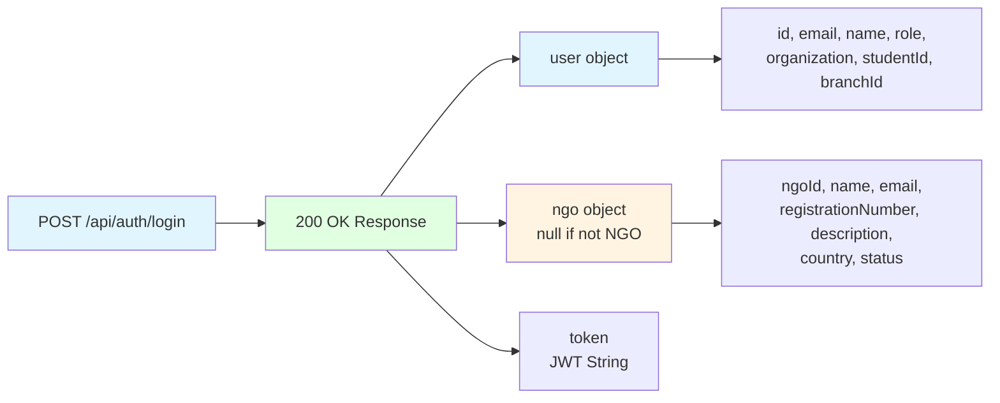
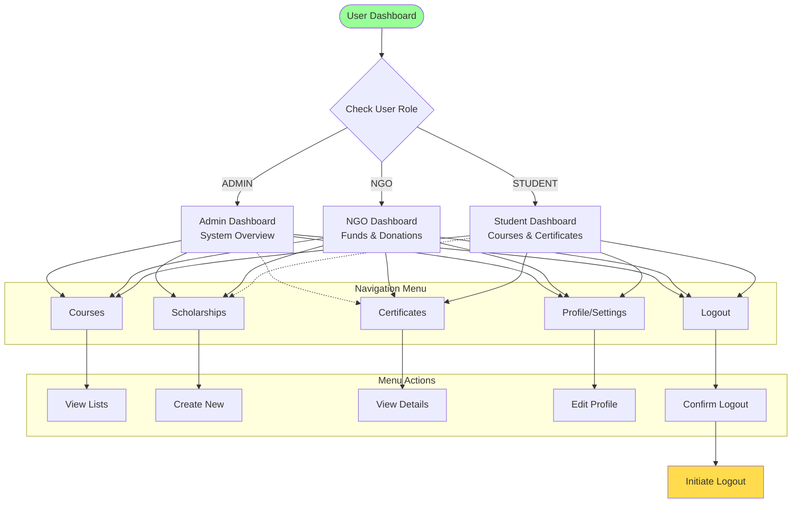
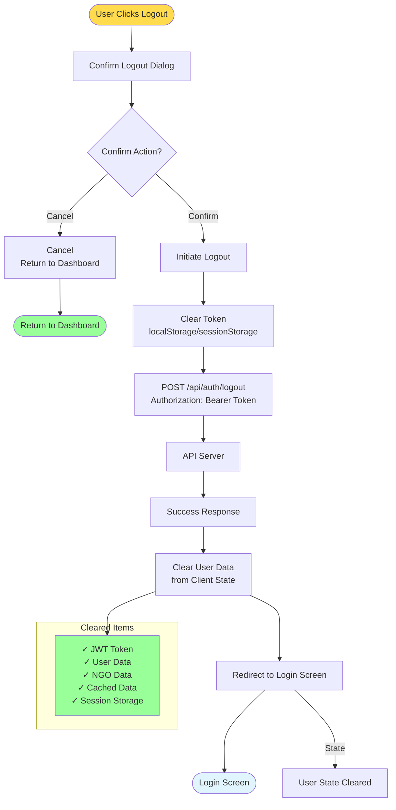
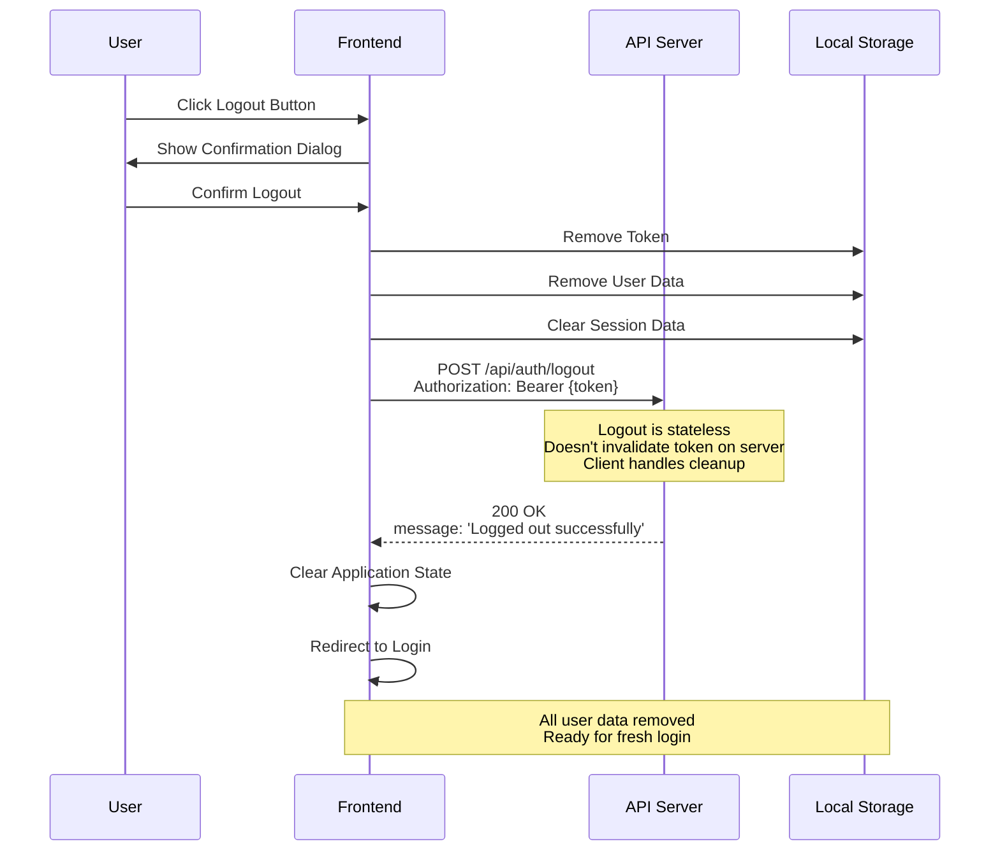
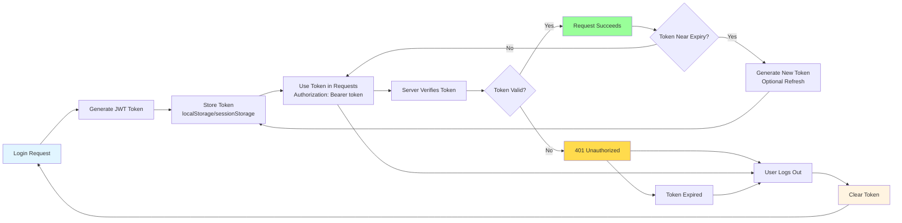
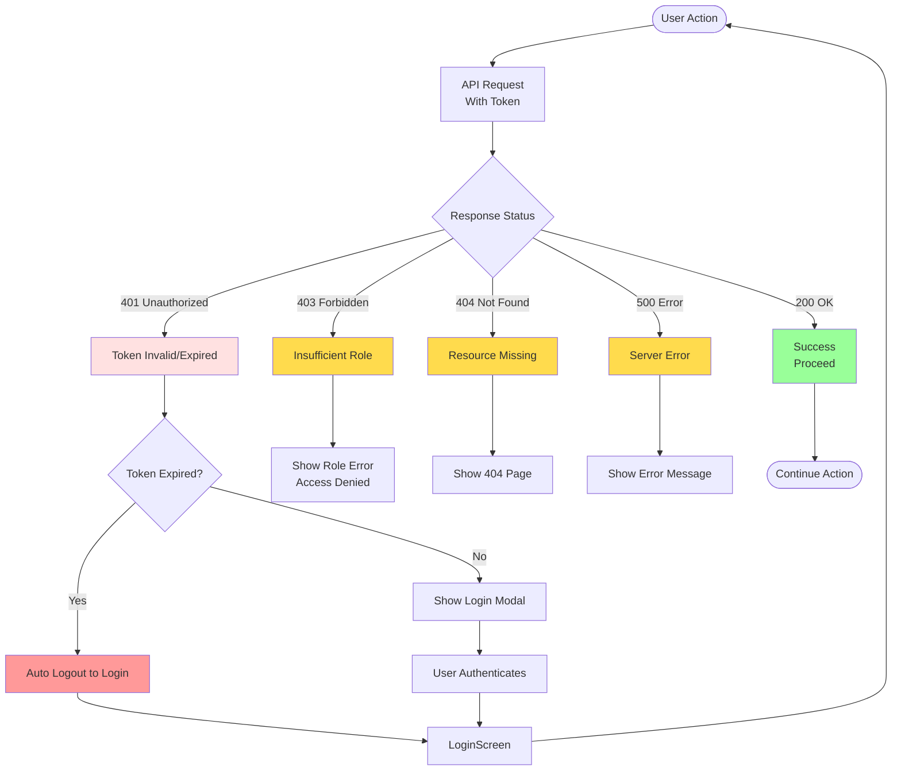

# Login to Logout Flow

This document provides detailed flowcharts for the complete user session lifecycle from login to logout.

---

## Table of Contents

1. [Complete Login Flow](#complete-login-flow)
2. [Dashboard & Navigation Flow](#dashboard--navigation-flow)
3. [User Action Flows by Role](#user-action-flows-by-role)
4. [Logout Flow](#logout-flow)

---

## Complete Login Flow



### Login Response Structure



---

## Dashboard & Navigation Flow



---

## User Action Flows by Role

### ADMIN User Flow

```mermaid
flowchart TD
    AdminLogin([Admin Logged In]) --> Admin[Admin Dashboard]
    
    Admin --> Action1{Select Action}
    
    Action1 -->|View Courses| Courses[View All Courses]
    Action1 -->|Create Course| NewCourse[Create New Course]
    Action1 -->|View Certs| AdminCerts[View All Certificates]
    Action1 -->|View Users| Users[Manage Users]
    Action1 -->|View Stats| AdminStats[System Statistics]
    
    Courses --> CoursesList[All Courses List]
    CoursesList --> CourseAction{Select Course}
    CourseAction -->|View| CourseDetail[Course Details]
    CourseAction -->|Edit| EditCourse[Edit Course]
    
    NewCourse --> CourseForm[Course Form]
    CourseForm --> SubmitCourse[POST /api/courses]
    SubmitCourse --> |Success| CourseSuccess[Course Created ✓]
    SubmitCourse ||Fail| CourseFail[Error ❌]
    
    CourseSuccess --> Admin
    CourseFail --> CourseForm
    
    AdminCerts --> CertsList[All Certificates List]
    CertsList --> VerifyAction[Verify Certificate]
    
    VerifyAction --> PublicLink[Open Public Link<br/>/api/verify/:certId]
    PublicLink --> VerifyResult{Valid?}
    VerifyResult -->|Yes| ValidCert[✓ Valid Certificate]
    VerifyResult -->|No| InvalidCert[✗ Invalid/Expired]
    
    Admin --> Action2{Continue or Logout?}
    Action2 -->|Continue| Admin
    Action2 -->|Logout| Logout
    
    style AdminLogin fill:#e1ffe1
    style Logout fill:#ffdb4d
    style CourseSuccess fill:#99ff99
    style CourseFail fill:#ffdb4d
```

### NGO User Flow

```mermaid
flowchart TD
    NGOLogin([NGO Logged In]) --> NGO[NGO Dashboard]
    
    NGO --> NGOMenu{Select Menu}
    
    NGOMenu -->|My Funds| MyFunds[My Scholarship Funds]
    NGOMenu -->|Create Fund| CreateFund[Create New Fund]
    NGOMenu -->|Add Donation| Donation[Add Donation]
    NGOMenu -->|Manage Funds| Manager[Manage Allocations]
    NGOMenu -->|View Certs| NGOCerts[Verified Certificates]
    NGOMenu -->|Profile| Profile[NGO Profile]
    
    MyFunds --> FundsList[My Funds List]
    FundsList --> FundSelect{Select Fund}
    FundSelect -->|View| FundDetail[Fund Details & Stats]
    FundSelect -->|Edit| EditFund[Edit Fund]
    
    CreateFund --> FundForm[Fund Creation Form]
    FundForm --> SubmitFund[POST /api/scholarships/funds<br/>Authorization: Bearer Token]
    SubmitFund --> |Success| FundSuccess[Fund Created ✓<br/>Owner Auto-Attached]
    SubmitFund ||Fail| FundFail[Error ❌]
    
    Donation --> DonationForm[Donation Form]
    DonationForm --> SubmitDon[POST /api/scholarships/donations]
    SubmitDon --> |Success| DonSuccess[Donation Recorded ✓]
    SubmitDon ||Fail| DonFail[Error ❌]
    
    Manager --> AllocsList[Allocations List]
    AllocsList --> AllocAction{Allocation Status}
    AllocAction -->|Pending| Approve[Approve Allocation]
    AllocAction -->|Approved| Disburse[Disburse Funds]
    
    Disburse --> DisburseForm[Disbursement Form]
    DisburseForm --> SubmitDisburse[POST /api/scholarships/disburse]
    SubmitDisburse --> |Success| DisbSuccess[Funds Disbursed ✓]
    SubmitDisburse ||Fail| DisbFail[Error ❌]
    
    FundSuccess --> NGO
    FundFail --> FundForm
    DonSuccess --> NGO
    DonFail --> DonationForm
    Approve --> NGO
    DisbSuccess --> NGO
    DisbFail --> DisburseForm
    
    NGO --> NGOLogout{Logout?}
    NGOLogout -->|Yes| Logout
    NGOLogout -->|No| NGOMenu
    
    style NGOLogin fill:#fff4e1
    style Logout fill:#ffdb4d
    style FundSuccess fill:#99ff99
    style FundFail fill:#ffdb4d
```

### STUDENT User Flow

```mermaid
flowchart TD
    StudentLogin([Student Logged In]) --> Student[Student Dashboard]
    
    Student --> StudentMenu{Select Menu}
    
    StudentMenu -->|Browse Courses| Browse[Browse Available Courses]
    StudentMenu -->|My Courses| MyCourses[My Enrolled Courses]
    StudentMenu -->|Progress| UpdateProg[Update Progress]
    StudentMenu -->|My Certs| StudentCerts[My Certificates]
    StudentMenu -->|My Scholarships| StudentSchols[My Scholarships]
    StudentMenu -->|Profile| StudentProfile[Student Profile]
    
    Browse --> Catalog[Course Catalog]
    Catalog --> SelectCourse{Select Course}
    SelectCourse -->|Enroll| EnrollBtn[Enroll Button]
    SelectCourse -->|Details| CourseDetails[Course Details]
    
    EnrollBtn --> EnrollAction[POST /api/courses/enroll]
    EnrollAction --> |Success| Enrolled[Enrolled ✓]
    EnrollAction ||Fail| EnrollFail[Course Full/Error]
    
    MyCourses --> EnrollList[Active Enrollments]
    EnrollList --> CourseSelect{Select Course}
    CourseSelect --> ViewProg[View Progress]
    CourseSelect --> ViewModules[View Modules]
    
    UpdateProg --> ProgForm[Progress Update Form]
    ProgForm --> SubmitProg[PUT /api/courses/{id}/progress]
    SubmitProg --> |Success| ProgSuccess[Progress Updated ✓]
    SubmitProg ||Fail| ProgFail[Error ❌]
    
    StudentSchols --> ScholarList[My Scholarships]
    ScholarList --> ScholarAction{Scholarship Status}
    ScholarAction -->|Allocated| Allocated[View Allocation Details]
    ScholarAction -->|Disbursed| ViewDisb[View Disbursement]
    
    StudentCerts --> CertPublic[Public Verification Links]
    CertPublic --> ShareAction[Share Certificate]
    
    ShareAction --> PublicLink[/api/verify/:certId]
    PublicLink --> VerifyResult[Verification Result]
    
    Enrolled --> Student
    EnrollFail --> Catalog
    ProgSuccess --> Student
    ProgFail --> ProgForm
    Allocated --> Student
    ViewDisb --> Student
    VerifyResult --> Student
    
    Student --> StudentLogout{Logout?}
    StudentLogout -->|Yes| Logout
    StudentLogout -->|No| StudentMenu
    
    style StudentLogin fill:#e1f5ff
    style Logout fill:#ffdb4d
    style Enrolled fill:#99ff99
    style ProgSuccess fill:#99ff99
```

---

## Logout Flow



### Logout Implementation Details



---

## Complete Session Lifecycle

```mermaid
stateDiagram-v2
    [*] --> NotAuthenticated: User Opens App
    
    NotAuthenticated --> Authenticating: Enters Credentials
    Authenticating --> Authenticated: Login Successful
    
    Authenticated --> SessionStart: Token Stored<br/>User Logged In
    
    SessionStart --> ActiveSession: Using Application
    
    subgraph "Possible Actions During Session"
        ActiveSession --> AdminActions: ADMIN Actions
        ActiveSession --> NGOActions: NGO Actions
        ActiveSession --> StudentActions: STUDENT Actions
        
        AdminActions --> ActiveSession
        NGOActions --> ActiveSession
        StudentActions --> ActiveSession
    end
    
    ActiveSession --> TokenExpired{Token Expired?}
    ActiveSession --> LogoutInit: User Clicks Logout
    
    TokenExpired -->|Yes| AutoLogout: Auto Logout
    TokenExpired -->|No| ActiveSession
    
    LogoutInit --> LoggingOut: Confirm Logout
    LoggingOut --> SessionEnd: Token Cleared
    AutoLogout --> SessionEnd
    
    SessionEnd --> LoggedOut: Redirect to Login
    LoggedOut --> NotAuthenticated
    
    note right of SessionStart
        Token stored in localStorage<br/>User data loaded<br/>Dashboard displayed
    end note
    
    note right of TokenExpired
        Token expires after 24 hours<br/>Next API call returns 401
    end note
    
    note right of SessionEnd
        All local storage cleared<br/>Application state reset<br/>Ready for new user
    end note
```

---

## Token Lifecycle



---

## Error Handling During Session



---

## Role-Specific Login Experience

```mermaid
flowchart TD
    login([Login Screen]) --> AllRoles[All Roles Email/Password]
    
    AllRoles --> Success[Success → JWT Generated]
    
    Success --> RoleRoutes{User Role?}
    
    RoleRoutes -->|ADMIN| AdminRoute[/api/routes/admin]
    RoleRoutes -->|NGO| NGORoute[/api/routes/ngo-dashboard]
    RoleRoutes -->|STUDENT| StudentRoute[/api/routes/student-dashboard]
    
    AdminRoute --> AdminDash[Admin Dashboard]
    NGORoute --> NGODash[NGO Dashboard<br/>+ NGO Profile Loaded]
    StudentRoute --> StudentDash[Student Dashboard<br/>+ Student Profile Loaded]
    
    AdminDash --> AdminMenu
    NGODash --> NGOMenu
    StudentDash --> StudentMenu
    
    subgraph "Dashboard Features by Role"
        AdminMenu[✓ System Stats<br/>✓ User Management<br/>✓ All Resources<br/>✓ Logs & Audit]
        NGOMenu[✓ My Funds<br/>✓ Add Donation<br/>✓ Allocate Scholarships<br/>✓ View NGO Profile]
        StudentMenu[✓ My Courses<br/>✓ My Certificates<br/>✓ My Scholarships<br/>✓ Progress Tracking]
    end
    
    style login fill:#e1f5ff
    style AdminRoute fill:#e1ffe1
    style NGORoute fill:#fff4e1
    style StudentRoute fill:#e1f5ff
```

---

## Related Documentation

- [API Testing Guide](API_TESTING_GUIDE.md) - Complete login/logout API examples
- [RBAC API Documentation](RBAC_API_DOCUMENTATION.md) - Role-based access control details
- [System Flowchart](SYSTEM_FLOWCHART.md) - Complete system architecture
- [Authentication Service](../backend/services/auth.service.js) - Auth implementation
- [Auth Routes](../backend/routes/auth.routes.js) - Login/logout endpoints
